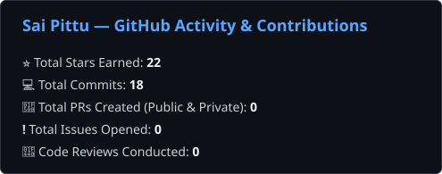

# Sai Pittu
### Founding Full Stack AI Engineer

Founding Full Stack AI Engineer with 1+ years of zero-to-one startup experience architecting and shipping AI-native products from concept through system design to production delivery. Currently owning product architecture, full-stack engineering, AI agent runtimes, and cloud infrastructure at Synxa IT (leading an engineering team of 4), while consulting on high-scale database infrastructure for YC-backed clients (Alephee, YC S21).

Specialized in building full-stack web applications, real-time voice streaming pipelines over WebSockets, Firecracker microVM and Linux jail code sandboxes, state-machine tool gating, offline evaluation harnesses, and containerized AWS infrastructure.

- Live Platform: **[Narad — AI-Native Hiring Platform](https://narad.synxait.in/)**

---

### Tech Stack & Core Competencies

#### Full-Stack & Backend Engineering

#### Databases, Queues & Distributed Systems

#### AI Systems, Harness & Sandboxing

#### Cloud, IaC & Observability

---

### Featured Production Systems

#### 1. [Narad — AI-Native Hiring Platform](https://narad.synxait.in/) (Founding Engineer)
*Zero-to-one hiring platform automating candidate evaluation via real-time voice screens, live coding sandboxes, and AI panel interviewers.*
- **Full-Stack Architecture & Leadership:** Architected Narad zero-to-one across a React frontend and dual Node.js/Express & Python/FastAPI microservices backends from concept through system design to production release, leading 4 engineers and enforcing data invariants where AI outputs remain advisory while human approvals gate stage progression.
- **Resume-Shortlisting Agent:** Built the automated screening engine using structured output parsing (`Pydantic`/`instructor`) and vector retrieval to generate defensible, evidence-backed candidate verdicts.
- **Real-Time Voice Screening Engine:** Engineered bi-directional WebSocket streaming STT → LLM → TTS (16 kHz PCM audio) delivering frame-accurate caption synchronization under 300ms round-trip latency.
- **State-Machine Tool Gating:** Designed XState FSM tool execution rules dynamically restricting tool exposure per turn so illegal agent behavior (e.g. skipping interview rounds) is structurally impossible.
- **Automated Panel Interviewer Agents:** Built multi-participant voice panel interviewer agents with STT speech attribution and "raised hand" VAD turn-taking.
- **Dual-Tier Sandboxed Code Execution:** Authored ADRs and built dual code sandboxes: Linux jails (namespaces, cgroups, 100-slot pool, <5ms startup) for stateless code grading and Firecracker microVMs for stateful coding rounds; fixed a critical JVM memory cap bug.
- **Offline LLM Evaluation Harness:** Built an offline eval harness sweeping 17 models × 2 personas (38 recorded runs) using a frontier LLM as judge to score agent honesty and naturalness.
- **Infrastructure & Observability:** Architected containerized cloud infrastructure using modular Terraform IaC (AWS EKS/ECS/S3), deploying ArgoCD for GitOps continuous delivery, Karpenter for Kubernetes node autoscaling, and OpenTelemetry + Langfuse + LGTM tracing across 8+ microservices.

#### 2. Alephee (Y Combinator S21) — Database Engineering Consultant
*Solo database workstream lead for a LatAm B2B e-commerce platform operating across 8 countries.*
- **SQL Server → PostgreSQL Replatforming:** Evaluated 919 GB / 4.6B row multi-tenant database estate (2,159 schema objects).
- **Compute Spend Optimization:** Modeled AWS RDS compute spend reduction from ~$180k/yr to ~$50k/yr on AWS Graviton by classifying schema dependencies and eliminating unneeded DBA utility objects.
- **Replication Pipeline:** Set up DMS T-SQL → PL/pgSQL conversion pipelines and MS-CDC change data capture pipelines for zero-downtime cutover rehearsal.

---

### GitHub Activity & Statistics

  

---

### Contact Information

- Email: sairamakrishna568@gmail.com
- LinkedIn: [linkedin.com/in/sairamakrishnaa](https://www.linkedin.com/in/sairamakrishnaa/)
